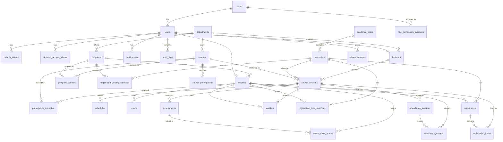

# Database Schema Reference

32 tables, one MySQL database. Sequelize's `underscored: true` maps every model's camelCase
attribute to a snake_case column (`courseSectionId` ↔ `course_section_id`); raw SQL must use the
snake_case form. **Migrations (`migrations/*.cjs`) are the schema's source of truth**; models
(`src/models/*.js`, wired together in `src/models/index.js`) mirror them 1:1 and are what this
document was checked against. If this file and either of those disagree, the code wins — update
this file, not the other way around.

## Entity-relationship diagram

## Identity & access

| Table | Purpose | Key columns / FKs | Business rule |
|---|---|---|---|
| `roles` | Normalized role lookup — `ROLE_PERMISSIONS` (`utils/constants.js`) maps role *names* to permissions, so this stays a table, not a hardcoded enum. | `name` (unique) | RBAC — CLAUDE.md "RBAC" |
| `users` | Single identity table for every actor (student, lecturer, admin, etc.); `students`/`lecturers` extend it 1:1. | `role_id → roles` (RESTRICT), `email` (unique), `password_hash`, `status` enum(active/suspended/pending), `token_version` (added in `20260928000001`) | Auth — access-token `ver` check |
| `refresh_tokens` | One row per issued refresh token; only the sha256 hash is stored, never the raw value. | `user_id → users` (CASCADE), `token_hash` (unique), `expires_at`, `revoked_at`, `replaced_by_hash` | Auth — "Refresh rotates the token. Presenting an already-revoked token revokes all of that user's tokens." |
| `revoked_access_tokens` | Blacklist of `jti`s for access tokens revoked before their natural expiry (single-device logout). | `jti` (unique `CHAR(36)`), `user_id → users` (CASCADE), `expires_at` | Auth — "Access tokens are revocable before expiry" |

## Academic structure

| Table | Purpose | Key columns / FKs | Business rule |
|---|---|---|---|
| `departments` | Owning org unit for programs, courses, and lecturers. | `code` (unique) | — |
| `programs` | A degree program a student is enrolled in. | `department_id → departments` (RESTRICT), `max_credits` (default 24) | Semester and credits — program `maxCredits` is a fallback in the credit-limit chain |
| `program_courses` | Curriculum junction: which courses a program's students may register for. | `program_id → programs` (CASCADE), `course_id → courses` (CASCADE), `type` enum(core/elective), unique(`program_id`,`course_id`) | Registration engine — "A new course is invisible to students until it is added there" |
| `students` | 1:1 extension of `users` for the student role. `student_number` is generated on self sign-up (`STU` + admission year + row id, e.g. `STU20260042`) and self sign-ups start at `level` 100; staff can set both when creating a student directly. | `user_id → users` (CASCADE, unique), `program_id → programs` (RESTRICT), `student_number` (unique), `academic_hold` | — |
| `lecturers` | 1:1 extension of `users` for the lecturer role. | `user_id → users` (CASCADE, unique), `department_id → departments` (RESTRICT) | — |
| `academic_years` | Parent of `semesters` — a year is not the same entity as a semester. | `name` (unique), `start_date`/`end_date` | — |
| `semesters` | One registration cycle. Registration always runs against the single semester with `is_current = true`. | `academic_year_id → academic_years` (RESTRICT), `registration_start`, `registration_end`, `add_drop_end`, `max_credits`, `is_current`, unique(`academic_year_id`,`name`) | Registration window; Semester and credits — semester `maxCredits` is checked before the program's |

## Catalog

| Table | Purpose | Key columns / FKs | Business rule |
|---|---|---|---|
| `courses` | Catalog entry. | `department_id → departments` (RESTRICT), `code` (unique), `credits`, `level`, `status` enum(active/inactive) | — |
| `course_prerequisites` | Self-join requirement graph — **not** a flat list. Rows sharing a non-null `(course_id, type, group_no)` are OR-alternatives; every distinct group is AND-required; `group_no IS NULL` means the row is its own group. | `course_id`/`prerequisite_course_id → courses` (CASCADE both), `type` enum(prerequisite/corequisite), `min_grade`, `group_no`, unique(`course_id`,`prerequisite_course_id`) | Requirements — "Don't give plain inserts a default group number, or unrelated prerequisites merge into one OR group"; corequisites enforced only at submit |
| `prerequisite_overrides` | Per-student/course/semester waiver, feeding into the `requirements` rule context. | `student_id → students` (CASCADE), `course_id → courses` (CASCADE), `semester_id → semesters` (CASCADE, nullable), `granted_by → users` (SET NULL), `reason` (required), unique(`student_id`,`course_id`,`semester_id`) | Requirements — `prerequisite.service.evaluateRequirements` |
| `course_sections` | One offering of a course in one semester. | `course_id → courses` (RESTRICT), `semester_id → semesters` (RESTRICT), `lecturer_id → lecturers` (SET NULL), `capacity`, `seats_taken` (CHECK `0 ≤ seats_taken ≤ capacity`), `waitlist_enabled`, unique(`course_id`,`semester_id`,`section_code`) | Concurrency — locked `FOR UPDATE` after the registration row; seat increment guarded both in SQL and by the CHECK constraint |
| `schedules` | The timetable: one row per section/day/time. `room` is a plain string, not a foreign key — see **Design decisions** below. | `course_section_id → course_sections` (CASCADE), `day` enum(MON–SUN), `start_time`/`end_time` (CHECK `start_time < end_time`), `room` | — |

## Registration engine

| Table | Purpose | Key columns / FKs | Business rule |
|---|---|---|---|
| `registrations` | One student's registration for one semester. | `student_id → students` (CASCADE), `semester_id → semesters` (RESTRICT), `status` enum(draft/submitted/approved/rejected/cancelled), `reference_number` (unique, assigned on first submit, never changes), `reviewed_by → users` (SET NULL), unique(`student_id`,`semester_id`) | Registration slip — verification HMAC covers reference + status + section IDs; `statusAfterChange` |
| `registration_items` | One section within a registration. | `registration_id → registrations` (CASCADE), `course_section_id → course_sections` (RESTRICT), `course_id → courses` (RESTRICT), `status` enum(registered/dropped), unique(`registration_id`,`course_section_id`) | `addItem`/`dropItem`/`submit` transactions |
| `waitlists` | Queue per section, separate from `registration_items`. | `student_id → students` (CASCADE), `course_section_id → course_sections` (CASCADE), `position`, `status` enum(waiting/notified/converted/cancelled), unique(`student_id`,`course_section_id`) | Waitlist — "on a drop, the next student in line is notified; the seat is not reserved for them" |
| `registration_priority_windows` | Staggered registration opening by level and/or program. | `semester_id → semesters` (CASCADE), `min_level`, `program_id → programs` (CASCADE, nullable), `opens_at` | `priority.service.resolveOpensAt` — "earliest matching entry" |
| `registration_time_overrides` | Individual early-access grant, overriding the windows above. | `student_id → students` (CASCADE), `semester_id → semesters` (CASCADE), `opens_at`, `reason`, unique(`student_id`,`semester_id`) | `resolveOpensAt` — "an individual override wins" |

## Grades

| Table | Purpose | Key columns / FKs | Business rule |
|---|---|---|---|
| `results` | One grade per student/course/semester. | `student_id → students` (CASCADE), `course_id → courses` (RESTRICT), `semester_id → semesters` (RESTRICT, nullable), `course_section_id → course_sections` (SET NULL), `status` enum(provisional/final), `entered_by → users` (SET NULL), `finalized_at`, unique(`student_id`,`course_id`,`semester_id`) | Grades — a section is finalised once it has any final result; only `PATCH /results/:id` (GRADE_MANAGE, mandatory reason) can change a grade after that |

## Teaching & communication

| Table | Purpose | Key columns / FKs | Business rule |
|---|---|---|---|
| `attendance_sessions` | One class meeting's register. | `course_section_id → course_sections` (CASCADE), `schedule_id → schedules` (SET NULL, nullable), `date`, `topic`, `taken_by → users` (SET NULL) | One register per section/date/slot, checked in `attendance.service` (a NULL slot can't be unique-indexed); lecturers only for sections they teach |
| `attendance_records` | Each rostered student's status for a session. | `attendance_session_id → attendance_sessions` (CASCADE), `student_id → students` (CASCADE), `status` enum(present/absent/late/excused), unique(`attendance_session_id`,`student_id`) | Present or late counts as attended |
| `assessments` | Coursework in a section. | `course_section_id → course_sections` (CASCADE), `type` enum, `max_score`, `weight`, `due_at`, `status` enum(draft/published), `created_by → users` (SET NULL) | Weights per section total ≤ 100; students only see published ones |
| `assessment_scores` | A student's score on an assessment. | `assessment_id → assessments` (CASCADE), `student_id → students` (CASCADE), `score` (nullable), `feedback`, unique(`assessment_id`,`student_id`) | Score ≤ `max_score` |
| `announcements` | A message to an audience; each recipient also gets an `ANNOUNCEMENT` notification. | `author_id → users` (CASCADE), `audience` enum(section/program/all_students/all_lecturers/all_staff/everyone), `course_section_id`, `program_id`, `pinned`, `recipient_count` | Lecturers may only post to sections they teach |

## System / cross-cutting

| Table | Purpose | Key columns / FKs | Business rule |
|---|---|---|---|
| `notifications` | User-facing notification feed. | `user_id → users` (CASCADE), `type`, `data` (JSON), `read_at` | `notification.service.isEmailable(type)` decides which types also send email |
| `audit_logs` | Generic audit trail, polymorphic — not tied to one entity, no FK enforced on `entity_type`/`entity_id`. | `user_id → users` (SET NULL), `action`, `entity_type`, `entity_id`, `metadata` (JSON) | Audit — `audit.service.log()` never throws; pass `transaction` for atomicity |
| `role_permission_overrides` | Admin edits to a role's permissions, stored as differences from `ROLE_PERMISSIONS`. | `role_id → roles` (CASCADE), `permission`, `granted` (true adds, false removes), `updated_by → users` (SET NULL), unique(`role_id`,`permission`) | USER and SUPER_ADMIN are fixed; `role:manage` is never grantable; cached in `permission.service` |
| `settings` | Single key/value config store. | `key` (unique), `value` (JSON) | "All default settings live in exactly one file" — `20260930000002-essential-settings.cjs`, `INSERT IGNORE` |

## Design decisions — what's deliberately not a table

**No `rooms` table.** `schedules.room` is a plain `STRING(50)`. Clashes are still checked
without one: the schedule service rejects a room or lecturer double-booking by comparing the
`room` string and times, and the registration rule `timetableConflict.rule.js` blocks a student
from adding overlapping classes (the demo seed's CS203/CS204 Wednesday overlap exists to
demonstrate that rule). A `rooms` master table would only be needed for room data the system
doesn't track today, such as seating capacity or building. Add it when that's actually needed.

**No `student_course_history` table.** A student's academic history is fully and correctly
derivable by joining `results` (what was completed, with grades) and `registrations`/
`registration_items` (what was registered) — which is exactly what `prerequisite.service
.evaluateRequirements` already does. A separate stored history table would duplicate that data and
require its own sync logic (triggers, or extra service-layer writes) to stay correct, for a
query-performance problem that hasn't actually been observed. Derived-and-normalized is the
correct call here, not a gap.

## Source of truth

This document summarizes `migrations/*.cjs` (schema) and `src/models/index.js` (associations). It
can drift; they can't. When in doubt, read the migration.
