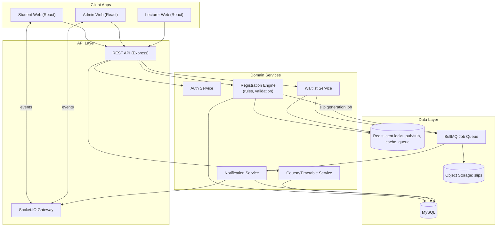

# UniReg — Student Course Registration System
## Technical Project Plan

---

## 1. Project Summary

| | |
|---|---|
| **Project** | UniReg — Real-Time University Course Registration Platform |
| **Type** | Multi-role web application (Student, Lecturer, Admin) |
| **Core challenge** | Not CRUD — a rules engine (prerequisites, capacity, conflicts, credit limits) with real-time state sync |
| **Primary risk areas** | Race conditions on seat capacity, prerequisite integrity, timetable-conflict correctness, registration-window enforcement |

The plan below sequences the work as: **data model → validation engine → REST API → real-time layer → UI → hardening**, because every later layer depends on the correctness of the ones before it. Building UI first against a fake API (as many teams do) works for demos but hides the actual hard problems, which are almost entirely on the backend.

---


### Backend
| Concern | Choice | Why |
|---|---|---|
| Runtime | Node.js + JavaScript | As specified |
| Framework | Express | Plain Express — routers/controllers/services/middleware structure, no framework abstraction overhead |
| ORM | Sequelize | Maps to MySQL, handles migrations and associations (belongsTo/hasMany for the FK-heavy schema below) |
| Database | MySQL | Relational integrity (prerequisites, FK constraints, unique constraints) enforced via InnoDB; `SELECT ... FOR UPDATE` available where row locking is needed |
| Cache / pub-sub | Redis | Two jobs: (1) atomic seat-counting via `INCR`/Lua scripts to prevent overselling, (2) Socket.IO adapter for horizontal scaling |
| Queue | BullMQ (Redis-backed) | Waitlist notification processing, email/slip dispatch, without blocking request threads |
| Real-time | Socket.IO (server) | Room-based broadcasting maps cleanly to "all students viewing course X" |
| Auth | jsonwebtoken (access token) + HTTP-only refresh cookie | Matches spec's security section |
| Password hashing | bcryptjs | |
| Validation | zod | Backend must re-validate everything the frontend checks — spec explicitly calls this out (Section 7). Every mutating route runs its payload through a zod schema before it touches a service. |
| Cross-origin | cors | |
| Config | dotenv | |
| Rate limiting | express-rate-limit | Applied at minimum to `/auth/*` and registration-mutation routes |

### Infrastructure
| Concern | Choice |
|---|---|
| Hosting (API) | Render / Railway / AWS ECS (pick based on budget — Render/Railway for MVP, ECS for scale) |
| Hosting (frontend) | Vercel / Netlify (static + CDN) |
| Database hosting | Neon / Supabase / AWS RDS (Postgres) |
| File/slip storage | S3-compatible (for generated registration slip PDFs) |
| CI/CD | GitHub Actions |
| Monitoring | Sentry (errors) + a basic uptime check; add proper APM later |

---

## 3. System Architecture



**Why the Registration Engine is its own box:** prerequisite checks, credit-limit checks, capacity checks, duplicate checks, conflict checks, and registration-window checks (Section 9 of the spec) are seven independent business rules that all gate one action. Modeling this as a single "Registration Validation Pipeline" (a chain of validators, each returning pass/fail + reason) keeps the logic testable and keeps the API from becoming a 300-line `if` block.

---

## 4. Database Schema (Refined)

The spec's table list (Section 22) is a solid starting point. Refinements below close gaps that will bite in production: explicit status enums, unique constraints that *enforce* business rules at the DB level (not just app code), and a few missing join tables.

Written below as generic SQL for readability; in Sequelize these become models with `sequelize.define(...)` or class-based models, migrations generated via `sequelize-cli`. All tables use the InnoDB engine (MySQL default) so foreign keys and transactions work as expected. For primary keys, either `INT AUTO_INCREMENT` (simplest, smallest indexes — recommended for MySQL) or `CHAR(36)` UUID (if you want IDs that are safe to expose in URLs without leaking sequence/volume) both work; the plan below just writes `id PK` and leaves that choice to you.

```sql
-- USERS & AUTH
users (
  id PK,
  student_id VARCHAR UNIQUE NULL,   -- null for admin/lecturer
  staff_id VARCHAR UNIQUE NULL,
  first_name, last_name, email UNIQUE,
  password_hash,
  role_id FK -> roles.id,
  status ENUM('active','suspended','pending_verification'),
  email_verified_at TIMESTAMP NULL,
  created_at, updated_at
)

roles ( id, name ENUM('student','lecturer','admin','advisor','dept_admin','super_admin') )

-- ACADEMIC STRUCTURE
departments ( id, name, code UNIQUE )
programs ( id, department_id FK, name, code UNIQUE, duration_years )
students (
  id, user_id FK UNIQUE, program_id FK, level INT,
  admission_year, status ENUM('active','probation','suspended','graduated'),
  academic_hold BOOLEAN DEFAULT false   -- Section 9: "Outstanding restrictions"
)
lecturers ( id, user_id FK UNIQUE, staff_id, department_id FK )

-- COURSES
courses (
  id, department_id FK, code VARCHAR UNIQUE, name, description,
  credits INT, level INT, status ENUM('active','inactive')
)
course_prerequisites (
  id, course_id FK, prerequisite_course_id FK,
  UNIQUE(course_id, prerequisite_course_id)
)

semesters (
  id, academic_year, name, start_date, end_date,
  registration_open TIMESTAMP, registration_close TIMESTAMP,
  add_drop_deadline TIMESTAMP,
  status ENUM('upcoming','open','closed')
)

course_sections (
  id, course_id FK, semester_id FK, lecturer_id FK,
  capacity INT, seats_taken INT DEFAULT 0,   -- denormalized counter, Redis-backed for atomicity
  status ENUM('active','cancelled'),
  UNIQUE(course_id, semester_id, lecturer_id)
)

class_schedules (
  id, course_section_id FK,
  day ENUM('MON','TUE','WED','THU','FRI','SAT'),
  start_time TIME, end_time TIME, room VARCHAR
  -- app-level + DB trigger check: no two rows with same room/day and overlapping time
)

-- RESULTS (prerequisite source of truth)
results (
  id, student_id FK, course_id FK, semester_id FK,
  grade VARCHAR, grade_point DECIMAL,
  UNIQUE(student_id, course_id, semester_id)
)

-- REGISTRATION
registrations (
  id, student_id FK, semester_id FK,
  status ENUM('draft','submitted','pending_approval','approved','rejected','cancelled'),
  submitted_at, approved_at
)

registration_items (
  id, registration_id FK, course_section_id FK,
  status ENUM('selected','registered','dropped','waitlisted'),
  registered_at, dropped_at,
  UNIQUE(registration_id, course_section_id)   -- enforces "no duplicate course" at DB level
)

waitlist_entries (
  id, student_id FK, course_section_id FK, position INT,
  status ENUM('waiting','notified','expired','converted'),
  created_at,
  UNIQUE(student_id, course_section_id)
)

-- AUDIT
audit_logs (
  id, user_id FK, action VARCHAR, entity_type, entity_id,
  metadata JSONB, ip_address, created_at
)
```

**Key integrity decisions:**
- `registration_items` has a unique constraint on `(registration_id, course_section_id)` — the duplicate-course rule (Section 9) becomes a database guarantee, not just an app check.
- `seats_taken` on `course_sections` is updated via a Redis atomic counter first (fast path, prevents overselling under concurrent requests), then persisted to Postgres — see Section 6 below.
- `academic_hold` on `students` is the flag for "outstanding restrictions" (Section 9).

---

## 5. Registration Validation Pipeline (the core business logic)

Model this as an ordered chain of independent validators. Each one takes `(student, section, currentSelections)` and returns `{ pass: boolean, reason?: string }`. The API runs the full chain and returns *all* failures at once (better UX than failing on the first one — matches Section 27's UX principle of "what happened, why, what next").

| Order | Validator | Checks against |
|---|---|---|
| 1 | Registration window open | `semester.registration_open <= now <= registration_close` |
| 2 | Academic hold | `student.academic_hold === false` |
| 3 | Duplicate course | not already in `registration_items` for this semester |
| 4 | Prerequisite | every `course_prerequisites` row for the course has a matching passing `results` row |
| 5 | Level eligibility | `course.level` vs `student.level` (if course is level-restricted) |
| 6 | Capacity | `seats_taken < capacity` (else offer waitlist) |
| 7 | Credit limit | `sum(selected credits) + course.credits <= program max` |
| 8 | Schedule conflict | pairwise overlap check across `class_schedules` for all currently-selected sections |

**Conflict detection algorithm (Section 10):** for two schedule entries on the same day, they conflict if `startA < endB AND startB < endA`. Run this pairwise across all sections in the student's current draft whenever a course is added — O(n²) is trivial at n ≤ ~10 courses per semester, no need to over-engineer this.

**Critical:** this exact same pipeline runs in one place, called by both the "add course" endpoint and the "submit registration" endpoint, so frontend and backend can never drift out of sync (spec explicitly warns about this in Sections 7 and 9).

---

## 6. Concurrency: Preventing Overselling

This is the single trickiest correctness problem in the spec (49/50 → two students both try to grab the last seat).

**Approach:** Redis `INCR` with a Lua script for atomicity:

```
-- pseudocode
seats_key = "section:{id}:seats_taken"
capacity = get_capacity(section_id)   -- cached

new_count = LUA_SCRIPT: "
  local current = tonumber(redis.call('GET', KEYS[1]) or '0')
  if current < tonumber(ARGV[1]) then
    return redis.call('INCR', KEYS[1])
  else
    return -1
  end
"
-- if returns -1 -> section full, offer waitlist
-- else -> proceed to write registration_items row, then async-sync seats_taken to MySQL
```

This avoids row-level DB locking under load and gives you a natural place to emit the `course.capacity.updated` Socket.IO event the instant the counter changes.

---

## 7. REST API Design (representative endpoints)

```
Auth
POST   /auth/register
POST   /auth/login
POST   /auth/logout
POST   /auth/refresh
POST   /auth/forgot-password
POST   /auth/reset-password
POST   /auth/verify-email
PATCH  /auth/change-password

Student Profile
GET    /students/me
PATCH  /students/me

Courses
GET    /courses?search=&department=&level=&semester=&credits=&availability=
GET    /courses/:id
GET    /courses/:id/prerequisites/check   -- returns qualified: true/false + missing list

Registration
GET    /registrations/current            -- current draft/submitted registration
POST   /registrations/items              -- add course (runs validation pipeline)
DELETE /registrations/items/:id          -- drop course
POST   /registrations/submit             -- final submit (re-runs full pipeline)
GET    /registrations/:id/slip           -- PDF download
GET    /registrations/history

Timetable
GET    /timetable/me

Waitlist
POST   /waitlist/:sectionId/join
GET    /waitlist/me
DELETE /waitlist/:id

Notifications
GET    /notifications
PATCH  /notifications/:id/read

--- Admin ---
POST   /admin/courses
PATCH  /admin/courses/:id
POST   /admin/sections
POST   /admin/schedules              -- checks room/lecturer conflicts
POST   /admin/semesters
PATCH  /admin/semesters/:id/status
GET    /admin/registrations?status=pending_approval
PATCH  /admin/registrations/:id/approve
PATCH  /admin/registrations/:id/reject
GET    /admin/reports/registration-trends
GET    /admin/reports/course-popularity
GET    /admin/audit-logs

--- Lecturer ---
GET    /lecturer/courses
GET    /lecturer/courses/:sectionId/students
```

Every mutating endpoint above re-runs the relevant slice of the validation pipeline server-side — never trust the client's "I already checked this" state.

---

## 8. Real-Time Event Contract

| Event | Payload (shape) | Emitted to |
|---|---|---|
| `course.capacity.updated` | `{ sectionId, seatsTaken, capacity }` | Room: `section:{id}` (everyone viewing that course) |
| `registration.created` | `{ registrationId, studentId }` | Room: `student:{id}`, Room: `admin:dashboard` |
| `registration.cancelled` | `{ registrationId }` | Room: `student:{id}` |
| `registration.status.changed` | `{ registrationId, status }` | Room: `student:{id}` |
| `waitlist.seat.available` | `{ sectionId, studentId, position }` | Room: `student:{id}` |
| `timetable.updated` | `{ studentId }` | Room: `student:{id}` |
| `notification.created` | `{ id, title, body }` | Room: `student:{id}` or `admin:dashboard` |

Use **rooms**, not a global broadcast — a 12,000-student university broadcasting every seat change to everyone would be wasteful and messy on the client. Join `section:{id}` room only when a student has that course's detail page or registration cart open.

---

## 9. Role-Based Access Control

| Capability | Student | Lecturer | Advisor | Registrar/Admin | Dept Admin | Super Admin |
|---|:---:|:---:|:---:|:---:|:---:|:---:|
| Register/drop own courses | ✓ | | | | | |
| View own timetable | ✓ | ✓ | | ✓ | ✓ | ✓ |
| View assigned course roster | | ✓ | | ✓ | ✓ | ✓ |
| Approve/reject registrations | | | ✓ | ✓ | | ✓ |
| Create/edit courses | | | | | ✓ | ✓ |
| Manage semesters & registration windows | | | | ✓ | | ✓ |
| View university-wide reports | | | | ✓ | | ✓ |
| Manage roles/permissions | | | | | | ✓ |

**V1 simplification (per spec Section 2):** collapse to `Student → Lecturer → Admin`, with Admin covering Registrar/Advisor/Dept Admin/Super Admin responsibilities. Implement RBAC as **Express middleware checking a permissions array on the role** (e.g. `requirePermission('registration:approve')`), not hardcoded role-name checks — this makes the later expansion to 6 roles a data change, not a code change.

---

## 11. Testing Strategy

| Layer | Approach |
|---|---|
| Unit | Every validator in the registration pipeline gets isolated unit tests (prerequisite pass/fail, capacity edge cases, conflict overlap math) |
| Integration | API tests (Jest + Supertest) against a real test MySQL instance (Testcontainers or a dedicated `unireg_test` schema, reset between runs) covering the full add→drop→submit lifecycle |
| Concurrency | Dedicated test: fire N parallel "add course" requests at a section with 1 remaining seat, assert exactly 1 succeeds and N-1 get "full/waitlist" |
| E2E | Playwright: student registration happy path, prerequisite-block path, conflict-block path, admin course/schedule creation |
| Real-time | Socket.IO integration test: two connected clients, one registers, assert the other receives `course.capacity.updated` |

---

## 12. Suggested Repo Structure

```
unireg/
├── apps/
│   ├── web/                     # React + Vite (JSX)
│   │   ├── src/
│   │   │   ├── features/        # dashboard, courses, registration, timetable, admin
│   │   │   ├── shared/          # ui components, hooks
│   │   │   └── lib/             # axios client, socket client, react-query setup
│   └── api/                     # Express
│       ├── src/
│       │   ├── config/          # dotenv-loaded config, sequelize instance
│       │   ├── models/          # Sequelize models (User, Course, Section, Registration, ...)
│       │   ├── migrations/      # sequelize-cli migrations
│       │   ├── routes/          # auth.routes.js, courses.routes.js, registration.routes.js, admin.routes.js ...
│       │   ├── controllers/     # request/response handling per route group
│       │   ├── services/        # business logic (registrationService, waitlistService, ...)
│       │   ├── validators/      # zod schemas per route
│       │   ├── registration/
│       │   │   └── pipeline/    # one file per validation rule (prerequisite, capacity, conflict, ...)
│       │   ├── middleware/      # auth (jwt verify), requirePermission, rate limiting, error handler
│       │   ├── realtime/        # socket.io gateway, room management
│       │   ├── jobs/            # BullMQ processors (waitlist notify, slip generation, email)
│       │   └── app.js
├── packages/
│   └── shared-schemas/          # zod schemas shared conceptually between web forms and api validators
└── docker-compose.yml           # mysql + redis for local dev
```

---

## 13. Open Decisions to Confirm Before Coding Starts

1. **Slip generation** — server-side PDF (e.g., `pdf-lib` or a headless-browser render, generated as a BullMQ job) vs client-side print — recommend server-side so the Registration ID and content are authoritative and can't be tampered with client-side.
2. **Waitlist notification window** — spec doesn't state how long a notified student has to claim a freed seat before it passes to the next person. Needs a business decision (commonly 24–48 hours) before the waitlist state machine can be finalized.
3. **Grade source for prerequisites** — assumes `results` table is populated from a separate/legacy academic records system. Need to confirm whether this is a manual admin import, a nightly sync, or a live integration — this affects Phase 1 timeline since prerequisite checks are useless without real result data.
4. **Primary key style** — `INT AUTO_INCREMENT` vs `CHAR(36)` UUID for MySQL primary keys (see Section 4) — worth deciding once, up front, since it touches every model and every route param.
